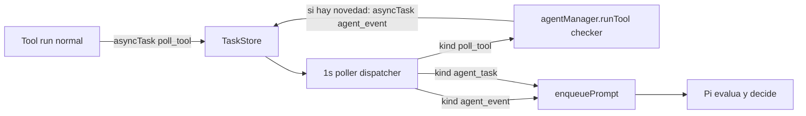

# Flow genérico de eventos asíncronos para tools

> Estado: propuesta / no implementado. Guardado como referencia.
> La implementación actual (timer) se mantiene; este documento describe una evolución posible.

## Problema

Hoy la única re-entrada asíncrona al agente es por tiempo: una tool devuelve `asyncTask` con `runAt` y el poller de 1s en `src/transport/telegram/bot.js` lo dispara como prompt. Eso obliga a resolver con timer (polling crudo, latencia fija, re-spawn de la tool y un turno completo del agente en cada chequeo). Falta una **cola de eventos entrantes** que despierte al agente solo cuando hay algo que evaluar.

## Solución (polling ordenado por cola, reusando TaskStore)

Dos nuevos `kind` de tarea, drenados por el mismo poller hacia el mismo `enqueuePrompt`:

- `poll_tool`: tarea recurrente que el poller **ejecuta directamente como tool** (no gasta turno del agente). El checker mantiene su propio cursor de estado en su config/tmp por chat. Si hay novedad, emite un `agent_event`.
- `agent_event`: evento entrante que se dispara de inmediato. El poller lo entrega como prompt para que Pi lo evalúe y decida.

## Cambios

### 1. TaskStore: eventos/polls sin hora se disparan ya

`src/core/tasks/task-store.js` - en `normalizeTask`, default `runAt` a `now` cuando no viene (los `agent_event` y el primer disparo de `poll_tool` deben ser inmediatos; `computeNextRunAt` ya reprograma `poll_tool` por su `recurrence`). Cambio de una línea, no rompe `agent_task` (siempre trae `runAt`).

### 2. AgentManager: extraer "run + materializar" (DRY)

`src/core/agent/agent-manager.js` - hoy el `execute` de `run_tool` (líneas ~184-242) hace: correr la tool, convertir `output.text`/`output.filePath` en artifacts y mandar `asyncTask(s)` al `TaskStore` con el `chatId`. Extraer eso a un método reusable `runTool({ name, request, chatId })`. El Pi tool `run_tool` pasa a llamarlo. Así el poller puede correr tools con la **misma** lógica de materialización (incluido el alta de `agent_event` que emita el checker).

### 3. Poller -> dispatcher por kind

`src/transport/telegram/bot.js` - reemplazar el handler de un solo kind dentro del `setInterval` (líneas ~361-380) por un dispatcher:

- `agent_task` -> `enqueuePrompt(buildAsyncTaskPrompt(task))` + `complete` (igual que hoy).
- `agent_event` -> `enqueuePrompt(buildAsyncEventPrompt(task))` + `complete`.
- `poll_tool` -> `agentManager.runTool({ name: task.payload.toolName, request: { args: task.payload.args || {} }, chatId })`; los `agent_event` que emita el checker quedan encolados para el próximo tick; luego `complete` (la `recurrence` reprograma el poll). Si la tool falla: log + `complete` para no matar el poll.

Agregar `buildAsyncEventPrompt(task)` junto a `buildAsyncTaskPrompt` (línea ~82), con framing de "llegó un evento externo, evalualo y decidí la próxima acción". Si el branch queda denso, extraer `dispatchDueTasks(...)` a una función para mantener `bot.js` como transporte.

### 4. Documentar el flow

`AGENTS.md` - sección nueva (en inglés) explicando: cómo una tool arma su auto-polling devolviendo un `asyncTask` kind `poll_tool` con `recurrence`, cómo emite novedades con `asyncTask` kind `agent_event`, que el checker guarda su cursor en su config/tmp por chat, y que el agente razona sobre el `agent_event` para decidir. `list_scheduled_tasks`/`cancel_scheduled_task` ya sirven (son kind-agnostic) para ver/cancelar polls.

## Contrato del checker tool (sin nuevas Pi tools)

Todo pasa por el campo `asyncTasks` que el pipeline ya soporta:

- Arranque del poll (desde el `run` de cualquier tool): `asyncTasks: [{ kind: "poll_tool", payload: { toolName, args }, recurrence: { type: "interval", everySeconds: N } }]`.
- Novedad (desde el `run` del checker): `asyncTasks: [{ kind: "agent_event", payload: { prompt: "<contenido a evaluar>" } }]`.

## No-goals (por ahora)

- No se agrega listener persistente (`node index.js listen`) ni proceso de fondo con IPC.
- No se agrega endpoint HTTP entrante para eventos.
- No se resuelve el caso de conexión sostenida (tipo cliente logueado): los checkers son one-shot y persisten su cursor entre corridas.

## Alternativas consideradas (descartadas para esta versión)

- **Listener tools**: la tool corre como proceso de larga duración (`node index.js listen`) y emite eventos por stdout que Arisa drena a la cola. Más general y realtime, pero agrega ciclo de vida de proceso a la service e IPC.
- **Webhook entrante**: Arisa expone un endpoint HTTP interno donde sistemas externos hacen POST de eventos. Bueno para callbacks; no sirve para los que requieren sostener una conexión.
